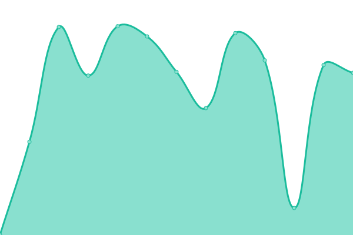

# [📈 Live Status](https://status.ops.monokera.site): <!--live status--> **🟩 All systems operational**

This repository contains the open-source uptime monitor and status page for [Monokera](https://monokera.com/), powered by [Upptime](https://github.com/upptime/upptime).

With [Upptime](https://upptime.js.org), you can get your own unlimited and free uptime monitor and status page, powered entirely by a GitHub repository. We use [Issues](https://github.com/monokera-tech/upptime/issues) as incident reports, [Actions](https://github.com/monokera-tech/upptime/actions) as uptime monitors, and [Pages](https://status.ops.monokera.site) for the status page.

<!--start: status pages-->
<!-- This summary is generated by Upptime (https://github.com/upptime/upptime) -->
<!-- Do not edit this manually, your changes will be overwritten -->
<!-- prettier-ignore -->
| URL | Status | History | Response Time | Uptime |
| --- | ------ | ------- | ------------- | ------ |
|  [Monokera Site](https://monokera.com/) | 🟩 Up | [monokera-site.yml](https://github.com/monokera-tech/upptime/commits/HEAD/history/monokera-site.yml) | 

 3181ms
     
 | 

<a href="https://status.ops.monokera.site/history/monokera-site">96.81%</a>
    

|  [API Gateway](https://apigw.prod.monokera.site) | 🟩 Up | [api-gateway.yml](https://github.com/monokera-tech/upptime/commits/HEAD/history/api-gateway.yml) | 

 112ms
     
 | 

<a href="https://status.ops.monokera.site/history/api-gateway">100.00%</a>
    

|  [CarroYa](https://asistencias.carroya.com) | 🟩 Up | [carro-ya.yml](https://github.com/monokera-tech/upptime/commits/HEAD/history/carro-ya.yml) | 

 359ms
     
 | 

<a href="https://status.ops.monokera.site/history/carro-ya">100.00%</a>
    

|  [Comfamiliar](https://servicios.monokera.com/compra-asistencias-y-seguros) | 🟩 Up | [comfamiliar.yml](https://github.com/monokera-tech/upptime/commits/HEAD/history/comfamiliar.yml) | 

 264ms
     
 | 

<a href="https://status.ops.monokera.site/history/comfamiliar">100.00%</a>
    

<!--end: status pages-->

[**Visit our status website →**](https://status.ops.monokera.site)

## 📄 License

- Powered by: [Upptime](https://github.com/upptime/upptime)
- Code: [MIT](./LICENSE) © [Monokera](https://monokera.com/)
- Data in the `./history` directory: [Open Database License](https://opendatacommons.org/licenses/odbl/1-0/)
